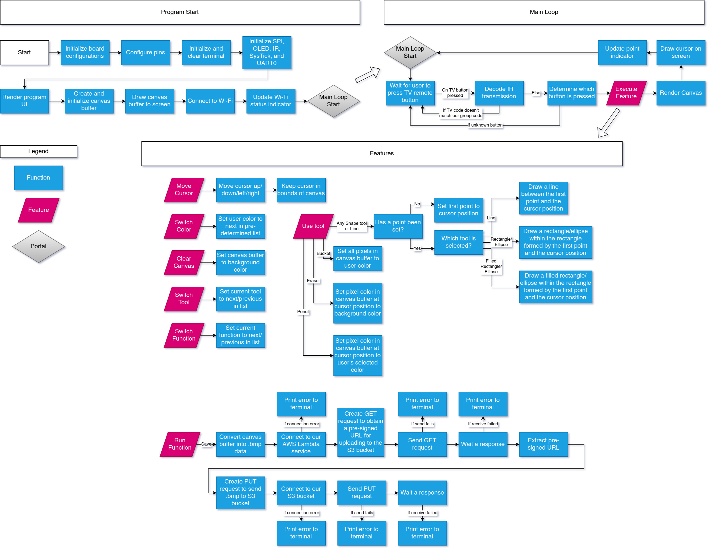

# Final Project – LaunchPad Paint

- [Overview](#overview)
- [Project Objectives](#project-objectives)
- [Requirements and Dependencies](#requirements-and-dependencies)
  - [Hardware Requirements](#hardware-requirements)
  - [Software Requirements](#software-requirements)
- [System Architecture](#system-architecture)
- [Functional Specification](#functional-specification)
- [Part I: Drawing Implementation](#part-i--drawing-implementation)
- [Part II: User Interface](#part-ii--user-interface)
- [Part III: Save Image to Cloud Storage](#part-iii--save-image-to-cloud-storage)
- [Video Demonstration](#video-demonstration)
- [Reproducibility](#reproducibility)
- [Future Work](#future-work)
- [Bill of Materials](#bill-of-materials)

---

# Overview

This project implements a remote-controlled drawing system using the CC3200 microcontroller, an OLED display, an IR receiver, and AWS cloud services. The system allows a user to draw on a digital canvas using a standard TV remote and view the drawing in real time on the OLED display. Once the drawing is complete, the image can be uploaded to cloud storage and sent to the user via email.

The project demonstrates a complete IoT workflow that integrates embedded hardware interaction, graphical rendering, wireless networking, and cloud services.

---

# Project Objectives

The goals of this project are:

- Implement a remote-controlled drawing interface
- Display drawing output on an OLED screen
- Support multiple drawing tools (pixel, line, rectangle, ellipse, fill)
- Upload saved drawings to cloud storage
- Send saved drawings to a user through email

---

# Requirements and Dependencies

## Hardware Requirements

- SimpleLink CC3200 LaunchPad
- OLED display (SPI interface)
- IR receiver module
- TV remote controller
- Breadboard and jumper wires
- Micro-USB cable

## Software Requirements

- Code Composer Studio (CCS)
- CC3200 SDK
- AWS IoT Services
- AWS Lambda
- Amazon S3
- Amazon SES

---

# System Architecture
The system consists of three major components: the embedded drawing device, cloud services, and the user interface.

1. The CC3200 connects to Wi-Fi and initializes the drawing system.
2. The IR receiver detects signals from the TV remote.
3. The CC3200 decodes the input and performs drawing operations on a framebuffer.
4. The framebuffer is rendered on the OLED display.
5. When the user saves the drawing, the device uploads the image to AWS S3.
6. A Lambda function processes the upload and sends the image to the user via email.

# Functional Specification

The functional specification describes the workflow of the drawing system, including initialization, user interaction, drawing operations, and cloud image upload.

1. When the program starts, the CC3200 initializes board configurations, GPIO pins, SPI, OLED display, SysTick, and UART.
2. The system creates the canvas buffer, renders the UI, draws the initial canvas, and connects to Wi-Fi.
3. The program enters the main loop and continuously waits for input from the IR remote controller.
4. When a button is pressed, the IR signal is decoded and the system determines which drawing feature to execute.
5. The system updates the cursor position, drawing tool, color, or canvas state, and then re-renders the canvas and cursor on the OLED display.
6. If the save function is triggered, the canvas buffer is converted to image data and uploaded to cloud storage using a pre-signed URL obtained from AWS.
7. 

# Part I: Drawing Implementation

The drawing system was developed using the code from **Lab 4** as the base template. Lab 4 already contains the TV remote input handling and text interface functionality, which allows the CC3200 to receive and decode button commands from the IR remote. Building on this foundation, the drawing features were integrated into the existing framework. The new implementation adds canvas management, cursor control, and drawing tools while reusing the remote input system to control drawing operations.

### Framebuffer and Canvas Management

The drawing canvas is represented by a framebuffer stored in memory. Each element of the framebuffer corresponds to a pixel on the OLED display. All drawing operations modify this buffer first before the updated image is rendered on the screen. This design allows the system to keep track of the entire drawing state and refresh the display efficiently.

### Cursor Movement

A cursor is used to indicate the current drawing position on the canvas. The cursor can move in four directions based on user input from the remote controller. Boundary checks ensure that the cursor remains within the canvas area. The cursor is visually displayed on the screen to help users position their drawings accurately.

### Basic Drawing Operations

The system supports drawing individual pixels using a pencil tool. When the user activates the drawing action, the pixel at the cursor position is updated with the currently selected color. The eraser tool works similarly but replaces the pixel color with the background color. These operations allow users to manually create or modify drawings on the canvas.

### Canvas Control

Users can reset the entire canvas when needed. The clear function removes all drawing content by resetting every pixel in the framebuffer to the background color. The updated blank canvas is then rendered to the display.

### Color and Tool Selection

The drawing system supports multiple colors and tools that users can switch between during operation. The available tools include pencil, eraser, line, rectangle, ellipse, and bucket fill. Switching tools changes how input actions are interpreted by the system.

### Shape Drawing

For geometric shapes such as lines, rectangles, and ellipses, the user selects two points on the canvas. The first point defines the starting position, and the second point defines the ending position or bounding region. The system then generates the corresponding shape between the two points.

### Bucket Fill

The bucket fill tool allows users to quickly color a connected region of the canvas. When activated, the system replaces neighboring pixels that share the same base color with the selected drawing color, producing a flood-fill effect similar to standard paint applications.

# Part II: User Interface

The user interface is built on the IR remote decoding implemented in **Lab 3**. The decoded signals from the TV remote are reused to map each button to a specific system function. By assigning different commands to the remote buttons, users can control cursor movement, switch drawing tools, change colors, apply drawing actions, and manage the canvas directly through the remote controller.

Button Mappings:

| Button | Function |
|------|------|
| Vol Up / Down | Change drawing tool |
| Ch Up / Down | Change tool mode |
| Mute | Change color |
| Last | Confirm operation |
| 2 | Move cursor up |
| 4 | Move cursor left |
| 6 | Move cursor right |
| 8 | Move cursor down |
| 5 | Apply drawing action |
| 0 | Clear canvas |

---

# Part III: Save Image to Cloud Storage

This system allows the user to save the generated drawing to the cloud and automatically receive the image through email. The process integrates the CC3200 device with several AWS services including API Gateway, Lambda, Amazon S3, and Amazon SES.

#### Step 1: Request a Pre-Signed Upload URL

When the user selects the save function, the CC3200 first prepares the canvas image for upload by converting the framebuffer into a `.bmp` image. 

The device then establishes a secure TLS connection to the AWS API Gateway endpoint using HTTPS (port 443). After the connection is created, the device sends an HTTP **GET request** to a Lambda function through the API Gateway. The Lambda function generates a **pre-signed URL** that allows the device to upload a file directly to the S3 bucket without exposing credentials. 

Once the Lambda function returns the response, the device extracts the upload URL from the JSON response.

#### Step 2: Upload Image to Amazon S3

After receiving the pre-signed URL, the CC3200 sends an HTTP **PUT request** to upload the generated `.bmp` image file to the S3 bucket.

The request includes:

- The pre-signed URL endpoint
- The content type (`image/bmp`)
- The size of the image data
- The binary image data generated from the canvas buffer

Once the PUT request completes successfully, the image is stored in the Amazon S3 bucket.

#### Step 3: Trigger S3 Event Notification

The S3 bucket is configured with an **event notification** that triggers whenever a new file is uploaded.

When the drawing image is saved in the bucket, Amazon S3 automatically emits a **PutObject event**, which invokes a second AWS Lambda function. This Lambda function receives the event information, including the bucket name and file key of the uploaded image.

#### Step 4: Retrieve the Image from S3

The Lambda function processes the event by extracting the uploaded file information. It then retrieves the image file from the S3 bucket using the AWS SDK.

The downloaded image data is converted into a binary buffer so it can be attached to an email.

#### Step 5: Send Image to the User via Email

Uses **Amazon SES (Simple Email Service)** to send the drawing image to the user.

The Lambda function constructs a raw MIME email message containing:

- The sender email address
- The recipient email address
- The email subject and message body
- The uploaded drawing image as an attachment

The image is encoded into **Base64 format** so it can be included in the email attachment.

After the email message is created, the Lambda function sends it using the SES API. The user then receives the generated drawing image as an email attachment.

---

# Video Demonstration

The following video demonstrates the major features of the system:

- Cursor movement using the remote
- Drawing pixels and shapes
- Changing colors
- Clearing the canvas
- Saving the drawing to the cloud
- Receiving the drawing via email

<video src="./launchpad-paint_demo_faster.mp4" width="490" height="270" controls></video>

---

# Future Work

Several improvements could be made in future versions of the project:

- Implement a gyroscope-based drawing tool
- Add a polygon drawing tool
- Support text input with an on-screen preview
- Allow switching between multiple Wi-Fi networks
- Add user authentication for cloud uploads
- Support multiple frames for animation creation

---

# Bill of Materials

| Component | Purpose |
|------|------|
| CC3200 Microcontroller | Core processing and Wi-Fi connectivity |
| SPI OLED Display | Display drawing canvas |
| IR Receiver | Receive remote control signals |
| AT&T S10-S3 Remote | User input device |
| AWS IoT Services | Cloud communication |
| Amazon S3 | Image storage |
| AWS Lambda | Cloud processing |
| Amazon SES | Email notification service |

---
